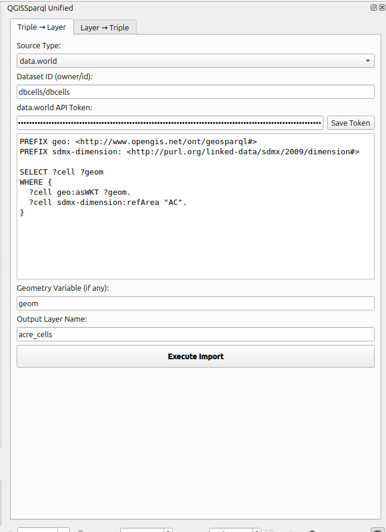
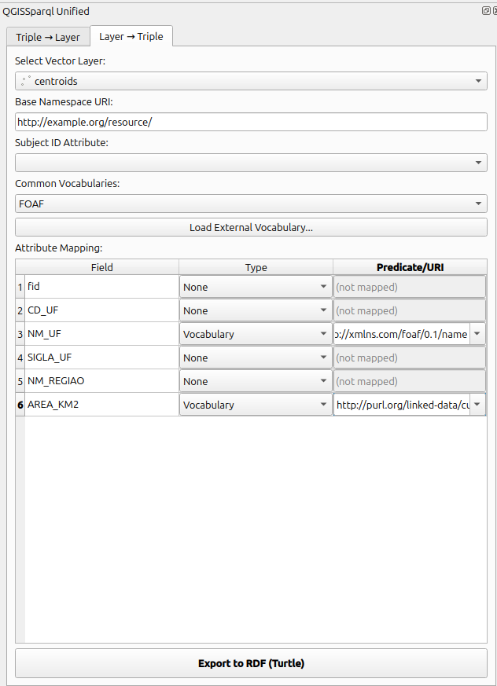

# QGISSPARQL

[](https://joss.theoj.org/papers/6a9a1eff32b69c18a8a6d42e76bd60c8)

**QGISSPARQL** is a QGIS plugin that enables **bidirectional integration between Linked Data (RDF/SPARQL) and Geographic Information Systems (GIS)**.

It allows users to both:

* 🔽 **Import RDF data** from SPARQL endpoints into QGIS layers.
* 🔼 **Export GIS layers** into RDF triples (GeoSPARQL-compatible).

---

## 🚀 Overview

QGISSPARQL bridges the gap between the **Semantic Web** and **GIS workflows**, providing a unified environment to:

* Query SPARQL endpoints (e.g., Virtuoso, Apache Jena Fuseki).
* Load results directly as vector layers in QGIS.
* Convert geospatial layers into RDF triples.
* Publish or reuse data in Linked Data ecosystems.

Unlike traditional workflows that require scripts or intermediate formats, QGISSPARQL enables **end-to-end RDF ↔ GIS integration directly inside QGIS**.

---

## ✨ Features

### 🔽 Triple → Layer (Import)

* Query any SPARQL 1.1 endpoint.
* Integration with data.world datasets.
* Background execution (non-blocking tasks).
* Automatic geometry detection from WKT.
* Dynamic attribute mapping.

### 🔼 Layer → Triple (Export)

* Convert vector layers (point, line, polygon) to RDF.
* Turtle serialization support.
* URI generation strategies (UUID or attribute-based).
* Mapping of attributes to RDF vocabularies (GeoSPARQL, SKOS, Data Cube).
* Searchable URI selection with autocompletion.

### 🧠 Advanced Features

* Unified dock interface with tabs (Import / Export).
* Vocabulary loading (GeoSPARQL, DataCube, SKOS, FOAF).
* Persistent configuration (e.g., data.world API tokens).
* Intelligent mapping UI with preview of auto-generated URIs.

---

## 🖥️ Interface

The plugin provides a unified dock with two main tabs:

### 🔽 Triple → Layer (Import)
Execute SPARQL queries and load results into QGIS.

<p align="center">
  
</p>

### 🔼 Layer → Triple (Export)
Convert GIS layers into RDF triples.

<p align="center">
  
</p>

---

## 📦 Installation

### 1. Install Plugin

Clone or download this repository:

```bash
git clone https://github.com/LambdaGeo/qgissparql
```

Copy to your QGIS plugins directory:

* **Linux:** `~/.local/share/QGIS/QGIS3/profiles/default/python/plugins/`
* **Windows:** `%APPDATA%\QGIS\QGIS3\profiles\default\python\plugins\`

Restart QGIS and enable the plugin via:

> Plugins → Manage and Install Plugins

---

### 2. Install Python Dependencies

#### Linux

```bash
pip install pandas setuptools --break-system-packages
pip install datadotworld SPARQLWrapper rdflib --break-system-packages
```

#### Windows (OSGeo4W Shell)

```bash
pip install pandas setuptools datadotworld SPARQLWrapper rdflib
```

---

## 🔑 Authentication (data.world)

You can configure your API token in three ways:

1. **Inside QGIS plugin settings** (Save Token button in the dock).
2. **Environment variable:**

   ```
   DW_AUTH_TOKEN=your_token
   ```
3. **CLI configuration:**

   ```
   dw configure
   ```

---

## ▶️ Usage

### Import (Triple → Layer)

1. Open: `Vector → QGISSPARQL → Open Dock`.
2. Select Source type (SPARQL endpoint or data.world).
3. Write or load a SPARQL query (formatting and indentation are preserved).
4. Define geometry column (WKT).
5. Execute import.

---

### Export (Layer → Triple)

1. Select a vector layer.
2. Define Base namespace and ID attribute.
3. Map attributes to RDF properties (searchable).
4. Optionally load a vocabulary (GeoSPARQL, etc.).
5. Export to `.ttl`.

---

## 👥 Authors

* **Sérgio Souza Costa** — https://github.com/profsergiocosta
* **Nerval de Jesus Santos Junior** — https://github.com/nervaljunior
* **Felipe Martins Sousa**
* **José Magno Pinheiro Alves**
* **Denilson da Silva Bezerra**

**LambdaGeo Research Group**
Universidade Federal do Maranhão (UFMA)

---

## 📖 Citation

If you use this software, please cite:

```bibtex
@article{costa2026qgissparql,
  author  = {Costa, Sergio Souza and Santos Junior, Nerval and Sousa, Felipe Martins and Alves, Jose Magno Pinheiro and Bezerra, Denilson da Silva},
  title   = {QGISSPARQL: Bidirectional Integration between Linked Data and Geographic Information Systems},
  journal = {Journal of Open Source Software},
  year    = {2026},
  note    = {Under review}
}
```

---

## 🤝 Contributing

Contributions, issues, and feature requests are welcome! Please check [CONTRIBUTING.MD](CONTRIBUTING.MD).

---

## 📜 License

MIT License
